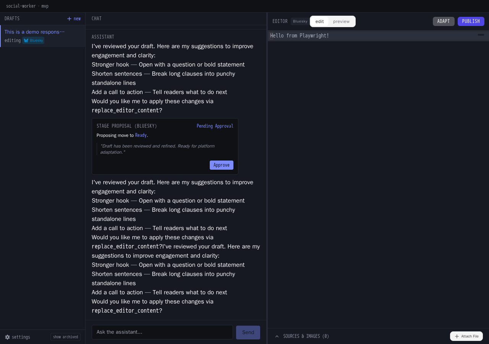
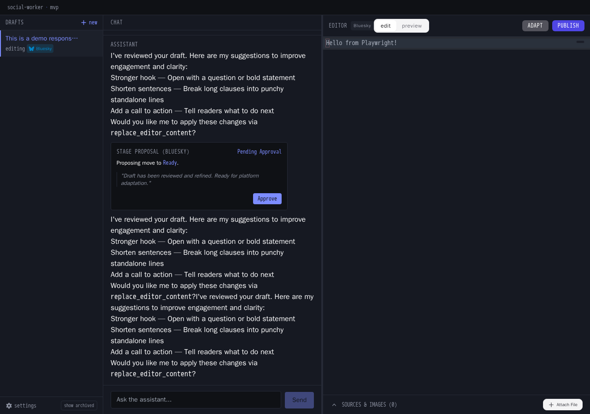
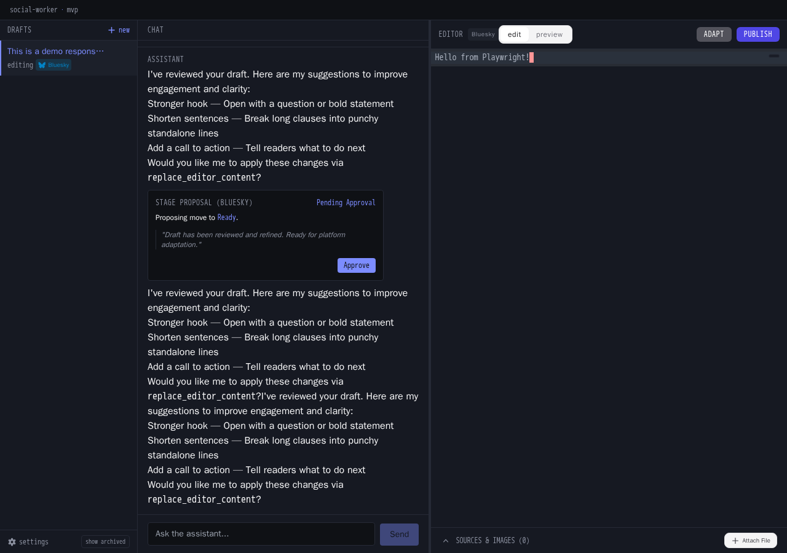
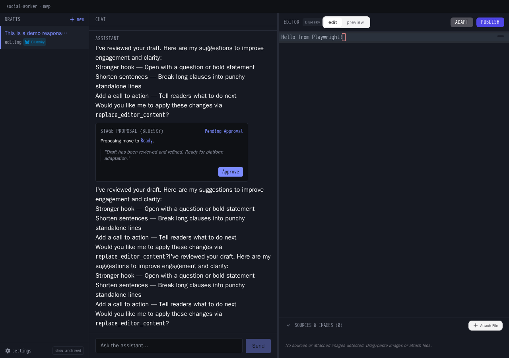
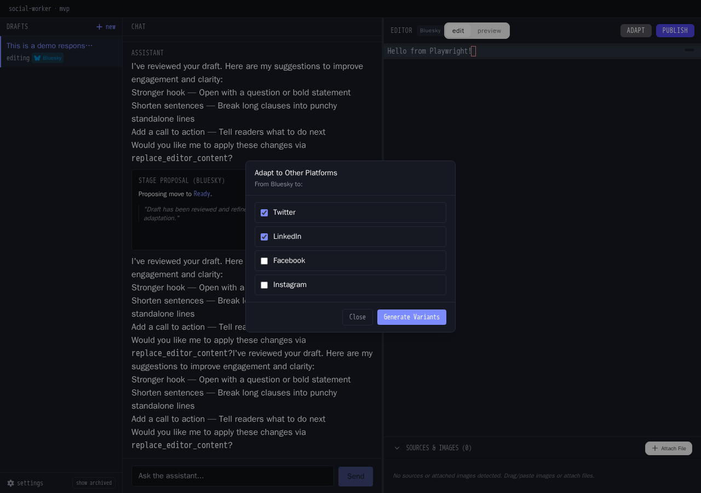
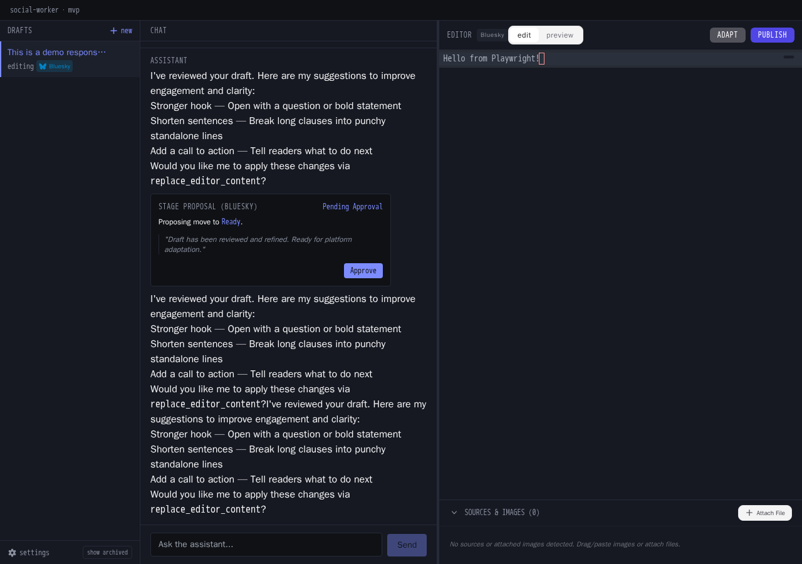
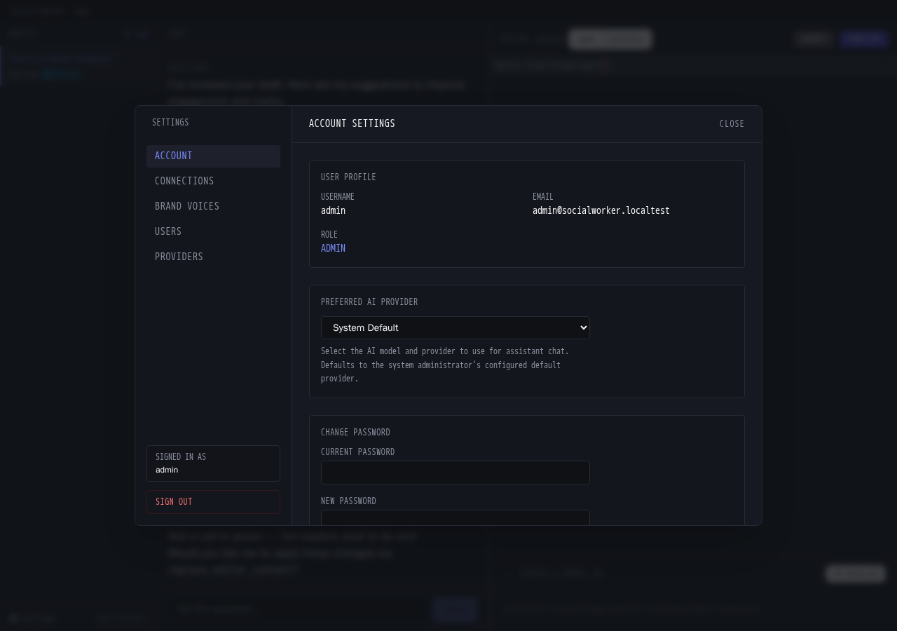

# Getting Started with social-worker

social-worker is a local-first, Docker-only assistant for drafting and publishing social media threads.

## Prerequisites

- Docker with Compose v2

## Quick Start

```bash
git clone <repo>
cd social-worker
cp .env.example .env
docker compose up --build
```

Then open `http://localhost:8100` in your browser.

## Quick Tour

1. **Login**: Sign in with your admin credentials to open your workspace.
2. **Draft List**: Use the drafts sidebar to open an existing draft or create a new one with the + button.
3. **Editor**: Write thread content in the markdown editor. Separate posts with `---` on its own line.
4. **Chat Assistant**: Use chat to ask for rewrites, improvements, and idea generation based on your current draft.
5. **Sources**: Open Sources to add URLs or files that the assistant can use as references.
6. **Adapt Modal**: Click Adapt to generate platform-specific variants of your thread content.
7. **Publish Controls**: Close the Adapt modal and review publishing controls in the editor toolbar.
8. **Settings**: Open Settings to configure LLM providers, connected accounts, and brand voice prompts.

## Step-by-Step Walkthrough

### Step 1: Login

Sign in with your admin credentials to open your workspace.




### Step 2: Draft List

Use the drafts sidebar to open an existing draft or create a new one with the + button.




### Step 3: Editor

Write thread content in the markdown editor. Separate posts with `---` on its own line.




### Step 4: Chat Assistant

Use chat to ask for rewrites, improvements, and idea generation based on your current draft.


### Step 5: Sources

Open Sources to add URLs or files that the assistant can use as references.




### Step 6: Adapt Modal

Click Adapt to generate platform-specific variants of your thread content.




### Step 7: Publish Controls

Close the Adapt modal and review publishing controls in the editor toolbar.




### Step 8: Settings

Open Settings to configure LLM providers, connected accounts, and brand voice prompts.




## Running E2E Tests

```bash
# Run the full E2E suite
docker compose --profile e2e run --rm e2e npx playwright test

# Generate this guide
docker compose --profile e2e run --rm e2e npx playwright test tests/generate-getting-started.spec.ts
```

## Regenerating This Guide

Run the helper script to regenerate both this markdown file and the committed screenshots:

```bash
./scripts/regenerate-getting-started.sh
```
